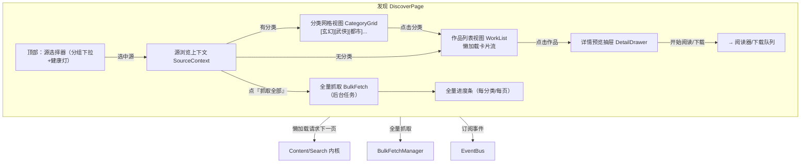

# 界面 2：发现

> 形态：选项卡
> 导航：发现
> 状态：**功能点讨论中**
> 核心定位：**浏览 + 全量兼顾** —— 既能按分类逛站，也能一键全量抓取选中源。

## 定位

「逛站」入口。选中一个源 → 看它的分类/作品 → 懒加载滚动 → 进详情。同时提供「一键全量抓取该源」能力，服务视频/漫画这类"直接拉全站"的需求。

> **关键原则：发现界面显示哪些源、源有没有分类，完全由源配置决定（`endpoints.discovery` 是否编写），框架不做任何基于类型的自行推断。**

## 功能点

| # | 功能点 | 说明 |
|---|---|---|
| 1 | 顶部源选择器 | **只列出配置了 `endpoints.discovery` 的源**（源里写了发现规则才会出现在发现界面）；按类型分组 + 健康灯 |
| 2 | 分类浏览 | **是否有分类 = 看源配置是否编写了分类规则**（`discovery.list_item` 分类项）。配了就显示分类网格，没配就跳过，不猜"此类型应该有没有" |
| 3 | 作品列表 | 源配置了分类 → 显示当前分类作品；源未配置分类规则 → 直接显示 `discovery.list_url` 的全站作品流 |
| 4 | **懒加载** | 滚动到底部自动加载下一页（`increment`/`next_link`/`cursor` 分页器），非翻页按钮 |
| 5 | 详情预览抽屉 | 点作品 → 右侧抽屉：封面/标题/简介/状态/标签 + 「开始阅读/下载」+「打开源详情页」 |
| 6 | **一键全量抓取** | 选中源 → 「抓取全部」按钮 → 后台遍历该源全部列表页/分类，聚合入库（见下） |
| 7 | 空状态/失效 | 无源：插画+去添加；源失效：健康灯红 + 提示去诊断 |

## 界面结构图



## 关键流程逻辑

### 懒加载滚动
```
滚动到底部
  → WorkList 检测到达阈值（距底部 < 200px）
  → 请求第 N+1 页（paginator.increment/next_link/cursor）
  → 新卡片追加到尾部
  → 无更多页（paginator 返回空）→ 显示"到底啦～"结束
```

### 分类浏览
```
发现界面源选择器 = 只列配置了 endpoints.discovery 的源（SourceManager 过滤）
选中源 → 读源配置 endpoints.discovery
  ├─ 配置了分类项(list_item) → CategoryGrid 渲染 → 点分类 → 请求分类列表 → WorkList 懒加载
  └─ 未配置分类规则 → 直接请求 discovery.list_url → WorkList 懒加载全站作品流
```

### 一键全量抓取（两种方案，见下）
```
点『抓取全部』
  → BulkFetchManager 启动后台任务
  → 遍历：全部分类（若有）→ 每分类翻页到底（约束 discovery/全局 max_pages）
  → 每作品：拉详情 → 拉全章节/分集 → 存本地
  → 进度经 EventBus → 首页迷你进度 + 本页进度条
  → 完成：归档到本地库（可进「书架」）
```

## 全量抓取的两个可执行方案（功能点讨论）

| 方案 | 做法 | 优点 | 缺点 | 适用 |
|---|---|---|---|---|
| **A. 全量下载到本地** | 遍历全站→拉详情→拉全部章节/图片→**落盘到本地库**（小说txt/漫画图集/视频地址清单） | 一次抓完离线可用；与书架天然衔接 | 量大（尤其漫画图）；占用磁盘 | 视频站（地址清单小）、小说站 |
| **B. 全量索引（仅元数据）** | 遍历全站→只存**元数据**（标题/链接/封面/更新）到本地索引库，**不拉正文/图片**；用户点开某本再按需拉 | 抓得快、占用极小；支持"站内全站搜索" | 离线不可看；仍需在线才能读正文 | 漫画站（图大）、想建全站索引 |

> 建议：**默认方案 B（全量索引）**，因为"全部爬取过来"更可能是想要"全站都能搜到/浏览到"，而不是瞬间把几百 G 图拉下来。方案 A 作为用户显式选择的"全量下载"动作（配合下载管理界面的队列）。

## 数据来源

| 区块 | 数据来源 |
|---|---|
| 源选择器列表 | `SourceManager` 过滤出**配置了 `endpoints.discovery`** 的源 |
| 分类 | 源配置 `endpoints.discovery` → `list_item.fields` |
| 作品列表 | 分类列表 URL / discovery.list_url + `paginator` |
| 详情抽屉 | `endpoints.detail` |
| 全量进度 | `BulkFetchManager` + EventBus |
| 源健康 | `SourceManager` + `selfcheck` 结果 |

## 空状态与异常

- 无源：插画 + "选择一个源，去逛逛吧～" + 「去添加源」
- 选中源失效：健康灯红 + "这个源好像迷路了" + 「去诊断」
- 懒加载到页尾：插画 + "到底啦～"
- 全量抓取中断：任务状态置「失败」，可重试（断点续抓待内核设计）

## 界面草图

```
┌──────────────────────────────────────────────────────────┐
│ [源选择器 ▼] 七猫小说 🟢  [抓取全部]                    │
├──────────────────────────────────────────────────────────┤
│  分类： [玄幻] [武侠] [都市] [科幻] [校园]                │
│  ┌────┐ ┌────┐ ┌────┐ ┌────┐ ┌────┐                     │
│  │    │ │    │ │    │ │    │ │    │   封面网格            │
│  │    │ │    │ │    │ │    │ │    │                     │
│  └────┘ └────┘ └────┘ └────┘ └────┘                     │
│  ┌────┐ ┌────┐ ┌────┐ ┌────┐ ┌────┐                     │
│  │    │ │    │ │    │ │    │ │    │   懒加载滚动...       │
│  └────┘ └────┘ └────┘ └────┘ └────┘                     │
│       （滚动到底 → 自动加载下一页）                       │
│   [右边抽屉：作品详情 / 开始阅读 / 下载]                  │
└──────────────────────────────────────────────────────────┘
```

## 已确认

- **全量抓取默认方案 B（仅元数据索引）**：遍历全站只存标题/链接/封面/更新，正文/图片按需再拉。全量下载（方案 A）作为用户在下载管理里显式触发的动作。
- **「抓取全部」有确认弹窗**：显示预计分类数 / 作品数，防误触。
- **视频站（无分类）「抓取全部」加软上限**：默认仅拉最近 20 页（可配置），防爆。
- **发现界面显示哪些源 / 源有没有分类，完全看源配置 `endpoints.discovery` 是否编写**：没写 discovery 的源不出现在发现界面；写了分类规则就显示分类网格，没写就跳过，框架不做类型推断。

## 待讨论
- （暂无，进入下一界面讨论）
