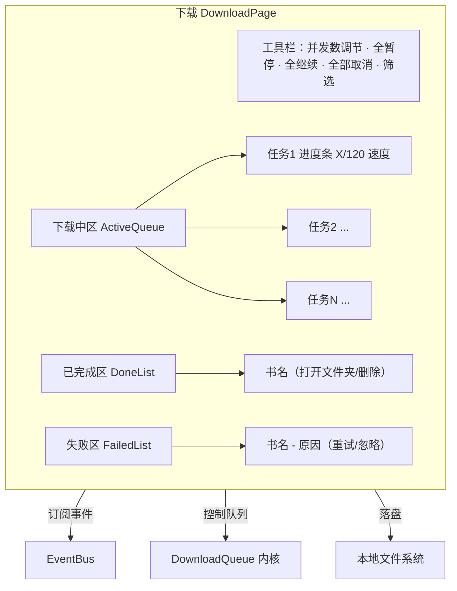

# 界面 5：下载管理

> 形态：选项卡
> 导航：下载
> 状态：**功能点已定稿**

## 定位

批量下载的队列、进度、并发、完成、失败管理。所有下载任务（发现全量下载 / 搜索批量加入 / 阅读器加入下载）汇聚于此。

## 功能点

| # | 功能点 | 说明 |
|---|---|---|
| 1 | 任务队列列表 | 每项：书名、章节/页/集、当前进度（X/120）、状态、速度 |
| 2 | **续传** | 中断后重下**跳过已下载章节**（`download.skip_existing`），漫画尤其重要 |
| 3 | **并发可调** | 并发数来自 `download.max_concurrent_downloads`，**界面可临时调整** |
| 4 | 单任务操作 | 暂停 / 继续 / 取消 / 重试 |
| 5 | 进度条 | 每任务进度条 + "5/120 章节" + "已用 X 秒 / 剩余 Y 秒" 估算 |
| 6 | 队列操作 | 全暂停 / 全继续 / 全部取消 |
| 7 | 已完成区 | 打开所在文件夹、删除本地文件 |
| 8 | 失败区 | 失败任务 + 原因 + 重试按钮；**自动重试 3 次后仍失败才标红** |
| 9 | 排序/筛选 | 按状态（下载中/完成/失败）、按内容类型筛选 |
| 10 | **下载完成通知** | 任务完成时系统托盘/桌面通知（可开关） |

## 界面结构图



## 关键流程逻辑

### 加入下载
```
任意入口「加入下载」
  → DownloadQueue.add(book, 目标章节集合)
  → 任务入队 → 检查并发槽 → 分配 worker
  → 下载前检查 skip_existing → 已存在章节直接跳过（续传）
  → 拉取 → 按 naming_template 落盘 → 进度经 EventBus 广播
```

### 并发调度
```
任务入队时
  → 若 running_count < concurrent → 立即启动
  → 否则进入 waiting 队列
  → 某任务完成/取消 → 释放槽位 → 从 waiting 补一个启动
```

### 失败重试
```
某任务/章节下载失败
  → 记失败原因 → 自动重试（最多 3 次，退避间隔递增）
  → 3 次仍失败 → 任务标红进失败区
  → 用户手动「重试」→ 清零计数再来
```

### 暂停/继续/取消
```
暂停：暂停该任务，已下载部分保留（可续传）
继续：恢复下载未完成部分
取消：终止任务，保留已下载，移出队列
```

### 时间估算
```
剩余时间 = (剩余章节数) × (已用时间 / 已下载章节数)
```

## 数据来源

| 区块 | 数据来源 |
|---|---|
| 任务列表 | `DownloadQueue`（内存 + 任务状态持久化可选） |
| 并发数 | `download.max_concurrent_downloads` + 界面临时调整 |
| 进度 | EventBus `DOWNLOAD_PROGRESS`（idx/total/path） |
| 已完成/失败 | 队列状态 + 本地文件扫描 |
| 命名模板 | `download.naming_template`（`{title}_{chapter_no}_{chapter_title}`） |

## 空状态与异常

- 无任务：插画 + "还没有下载任务哦，去发现里逛逛吧"
- 断网：任务全部标失败（自动重试后），可一键重试
- 磁盘满/无权限：写盘异常 → 任务失败 + 明确原因
- 源失效导致下载失败：进失败区 + 提示「该源失效，去诊断」

## 界面草图

```
┌──────────────────────────────────────────────────────────────┐
│ 并发:[-]4[+]  [全暂停] [全继续] [全取消]  筛选:[状态▾][类型▾]│
├──────────────────────────────────────────────────────────────┤
│ ▼ 下载中 (3)                                                  │
│  ┌────────────────────────────────────────────────────────┐  │
│  │ 凡人修仙传    45/120 ▓▓▓▓▓▓▓▓░░░ 38%  2.3MB/s 剩余2分   │  │
│  │              [暂停][取消]                               │  │
│  └────────────────────────────────────────────────────────┘  │
│  ┌────────────────────────────────────────────────────────┐  │
│  │ 咒术回战      12/30 ▓▓▓▓░░░░░░ 40%  1.1MB/s 剩余1分     │  │
│  │              [暂停][取消]                               │  │
│  └────────────────────────────────────────────────────────┘  │
│ ▼ 已完成 (12)                                                 │
│  │ 鬼灭之刃 全卷      [打开文件夹] [删除]                    │
│ ▼ 失败 (2)                                                    │
│  │ 某站X 第5话       连接超时(已重试3次)  [重试] [忽略]       │
└──────────────────────────────────────────────────────────────┘
```

## 已确认

- **续传**：跳过已下载章节（`skip_existing`）。
- **并发允许用户设置**：界面可临时调（`max_concurrent_downloads`）。
- **失败自动重试 3 次**：3 次仍失败才标红进失败区。
- **下载完成通知**：任务完成系统通知（可开关）。

## 待讨论
- （暂无，进入下一界面讨论）
