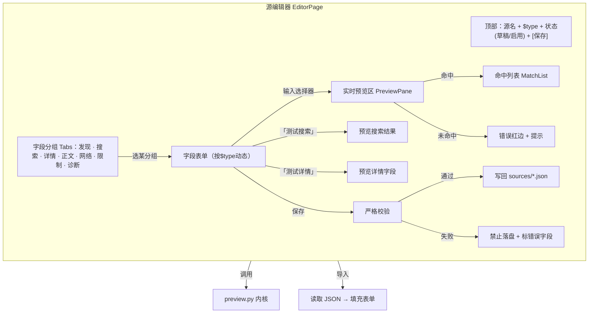

# 界面 8：源编辑器

> 形态：对话框 / 全屏
> 导航：从源管理进入
> 状态：**功能点已定稿**

## 定位

可视化编辑 `sources/*.json`，实时校验选择器。**表单为主**——JSON 只用于导入/导出与后端处理，不做源码视图编辑。架构 §14 + source-schema-v2。

## 功能点

| # | 功能点 | 说明 |
|---|---|---|
| 1 | 字段分组表单 | 按 `endpoints`（发现/搜索/详情/正文）+ transports + constraints + diagnostics 分组，**按 `$type` 动态显示**（novel 只显示章节块，不显示漫画/视频块） |
| 2 | **实时 selector 预览** | 输入选择器 → **自动防抖 500ms** 触发 `preview.validate_selector` → 显示命中列表 / 错误红边 |
| 3 | 一键「测试搜索」 | 输入关键词 → 调 `preview.search` → 显示解析结果 |
| 4 | 一键「测试详情」 | 输入详情 URL → 调 `preview.detail` → 显示解析字段 |
| 5 | **保存不变量** | 保存前必须过 `SourceConfig.from_dict` 严格校验，不过则禁止落盘 + 标出错误字段 |
| 6 | **允许残缺保存（草稿）** | 字段可不全就保存为本地草稿，但源不启用（`$enabled=false`），校验通过才可启用 |
| 7 | 新建/编辑切换 | 新建（复制模板 `template.example.json`）或编辑现有源 |
| 8 | 字段类型辅助 | selector 字段 CSS/XPath 切换；必填字段标红 |
| 9 | JSON 导入/导出 | 只做导入（读已有 JSON 填充表单）与导出（保存时生成 JSON 落盘），不提供源码编辑视图 |
| 10 | 失败诊断联动 | 从源管理诊断视图跳入时，自动定位失败字段 |

## 界面结构图



## 关键流程逻辑

### 编辑现有源
```
源管理 → 点「编辑」
  → 读取 sources/*.json → 填充分组表单
  → 按 $type 只显示对应字段块
```

### 新建源
```
源管理 → 「添加源」
  → 复制 template.example.json → 填充表单（字段可残缺）
  → 保存 → 写 sources/ 为新文件 → $enabled=false（草稿）
  → 补全字段过校验 → 用户手动启用
```

### 实时 selector 预览（防抖）
```
表单输入 selector → 停止输入 500ms
  → preview.validate_selector(source, url, field_name, selector)
  → 命中 → 显示命中列表（文本/属性值）
  → 未命中 → 字段红边 + "未命中任何元素，检查选择器或站点结构"
  → 请求频率受内核反爬间隔约束
```

### 测试搜索 / 测试详情
```
点「测试搜索」→ 输入关键词 → preview.search → 显示结果卡片（预览）
点「测试详情」→ 输入详情 URL → preview.detail → 显示解析字段
  → 均为只读预览，不落盘
```

### 保存（不变量 + 草稿）
```
点「保存」
  → SourceConfig.from_dict(当前表单) 严格校验
  → 通过 → 写回 sources/*.json
  → 失败 → 禁止落盘，标出错误字段 + 修复提示
  → （允许用户先以草稿保存：$enabled=false，校验不通过也可存草稿）
```

## 数据来源

| 区块 | 数据来源 |
|---|---|
| 表单字段 | `source-schema-v2.md` 各字段定义 |
| 实时预览 | `preview.validate_selector` |
| 测试搜索/详情 | `preview.search` / `preview.detail` |
| 校验 | `SourceConfig.from_dict` |
| 落盘 | `sources/*.json`（导出） |

## 空状态与异常

- 站点结构变更：预览返回错误 → 字段红边 + "站点结构已变更，请更新源配置"
- 预览请求超时：提示超时 + 可重试，不阻塞表单
- 保存校验失败：字段级高亮 + 原因
- 导入 JSON 不合法：提示错误行，不覆盖当前表单

## 界面草图

```
┌──────────────────────────────────────────────────────────────┐
│ 源名:[七猫小说___]  类型:[novel▾]  状态:草稿  [保存][导出JSON]│
├──────────────────────────────────────────────────────────────┤
│  [发现] [搜索] [详情] [正文] [网络] [限制] [诊断]             │
│ ───────────────────────────────────────────────────────────── │
│  搜索配置:                                                     │
│  基础URL   [https://www.qimao.com/search_________]             │
│  关键词参数[keyword]  方法[GET▾]  页码参数[page]              │
│  结果项选择器 [.book-item_____________] [CSS▾]  ⟳预览        │
│     └─ 命中 3 项: 标题 a.title / 封面 img / 链接 a.title      │
│  标题选择器 [a.title__________________] [CSS▾]  ⟳预览        │
│     └─ 命中: "凡人修仙传" "斗破苍穹" "诡秘之主"                │
│  封面选择器 [img.cover_______________] [CSS▾] [attr:src]⟳预览│
│    └─ ✗ 未命中 → 红边 "检查选择器或站点结构"                   │
│  [测试搜索...]  [测试详情...]                                  │
└──────────────────────────────────────────────────────────────┘
```

## 已确认

- 表单为主，JSON 只做导入/导出与后端处理。
- 实时预览自动防抖 500ms。
- 允许残缺保存（草稿，`$enabled=false`）。

## 待讨论
- （暂无，进入下一界面讨论）
