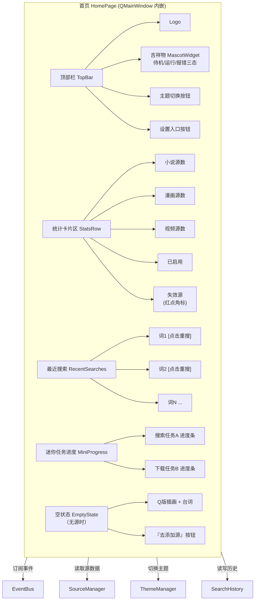

# 界面 1：首页 / 仪表盘

> 形态：窗口默认落地页
> 导航：首页（启动后第一个看到的 Tab）
> 状态：**功能点已定稿**

## 定位

应用入口。一进来就能看到：当前有哪些源、最近在搜什么、后台任务跑到哪了。信息密度适中，不做重型操作。

## 功能点（全部保留）

| # | 功能点 | 说明 |
|---|---|---|
| 1 | 顶部栏 | logo + **三态吉祥物**（待机/运行/报错）+ 主题切换按钮 + 设置入口按钮 |
| 2 | 统计卡片区 | 小说 / 漫画 / 视频 三类源计数、已启用源数、**失效源数（红点角标）** |
| 3 | 最近搜索历史 | 最近 N 条搜索词，点击一键重搜（数据与搜索页共享） |
| 4 | 迷你任务进度 | 当前后台搜索 / 下载的迷你进度条（通过 EventBus 订阅） |
| 5 | 空状态 | 无源时 Q 版插画 + 台词"还没有源哦，要不要找一只？" + 「去添加源」按钮（跳源管理） |
| 6 | 吉祥物三态联动 | 空闲=待机；后台任务运行中=运行（转圈/忙碌）；任一源报错=报错（叹气） |
| 7 | **批量更新检测** | 一键检查所有源是否有新章节/新剧集（拉各源"最近更新"列表对比） |

## 界面结构图



## 必要的类 / 基类

### 页基类（所有 Tab 页共用）

```python
class BasePage(QWidget):
    """所有 Tab 页的基类。统一页面生命周期 + 事件订阅接口。"""
    def on_theme_changed(self, theme: str) -> None: ...
    def on_event(self, event: Event) -> None: ...
    def refresh(self) -> None: ...      # 从数据源刷新本页
```

### 首页组件

```python
class HomePage(BasePage):
    """首页/仪表盘。"""
    def __init__(self, event_bus, source_manager, theme_manager, history):
        self.topbar = TopBar(event_bus, theme_manager)
        self.stats_row = StatsRow(source_manager)
        self.recent = RecentSearches(history)
        self.mini_progress = MiniProgress(event_bus)
        self.empty_state = EmptyState()

    def refresh(self) -> None:
        """重算统计卡片（源增删/失效变化时调用）。"""
        self.stats_row.reload()
        self.recent.reload()

    def on_event(self, event: Event) -> None:
        """订阅 EventBus：更新迷你进度 + 驱动吉祥物三态。"""
        self.mini_progress.on_event(event)
        self.topbar.mascot.on_event(event)

class TopBar(QWidget):
    def __init__(self, event_bus, theme_manager): ...
    def set_mascot_state(self, state: str) -> None: ...   # "idle"|"running"|"error"

class MascotWidget(QWidget):
    """三态吉祥物。"""
    STATES = ("idle", "running", "error")
    def set_state(self, state: str) -> None: ...
    def on_event(self, event: Event) -> None:
        # SEARCH_*/DOWNLOAD_* 进行中 → running
        # SOURCE_ERROR / STRUCTURE_CHANGED → error
        # 其余 → idle

class StatsRow(QWidget):
    def reload(self) -> None:
        """调 SourceManager.all() 统计三类源/启用/失效数。"""

class RecentSearches(QWidget):
    def reload(self) -> None: ...
    def signal_clicked(keyword: str) -> None: ...   # 点击词条 → 触发全局搜索

class MiniProgress(QWidget):
    def on_event(self, event: Event) -> None: ...   # 维护任务进度条

class EmptyState(QWidget):
    def signal_add_source() -> None: ...            # → 切换 Tab 到「源管理」
```

## 关键调用逻辑

### 初始化流程
```
App 启动
  → ThemeManager.load(app_config.ui.theme)          # 读主题
  → SourceManager.load(sources_dir)                 # 加载全部源
  → SearchHistory.load()                            # 读最近搜索
  → HomePage.refresh()
       ├─ stats_row.reload()   # 统计三类源
       ├─ recent.reload()      # 渲染最近搜索
       └─ (无源) empty_state 显示 / (有源) 正常区显示
  → EventBus 注册 → 吉祥物 idle
```

### 运行中事件驱动（吉祥物 + 迷你进度）
```
用户触发某源搜索
  → Search 发出 SEARCH_STARTED
       → EventBus.broadcast
            → MiniProgress 显示任务条
            → Mascot.set_state("running")
  → Search 完成 → SEARCH_COMPLETED
       → Mascot.set_state("idle")
某源报错
  → SOURCE_ERROR / STRUCTURE_CHANGED
       → Mascot.set_state("error")（持续到用户处理/超时）
       → stats_row 失效源红点 +1
```

### 最近搜索交互
```
点击最近搜索词
  → RecentSearches.signal_clicked(keyword)
       → 切换 Tab 到「搜索」
       → 预填关键词并自动执行搜索
       → SearchHistory.push(keyword)（若为新词）
```

## 数据来源

| 区块 | 数据来源 |
|---|---|
| 统计卡片 | `SourceManager.all()` → 按 content_type 分组 + `$enabled` + 失效标记 |
| 最近搜索 | `SearchHistory`（本地文件，与搜索页共享） |
| 迷你进度 | `EventBus` 的 `SEARCH_*` / `DOWNLOAD_*` 事件 |
| 吉祥物状态 | `EventBus` 全事件驱动 |
| 主题 | `app_config.ui.theme` + `ThemeManager` |

## 空状态与异常

- **无源**：Q 版插画 + "还没有源哦，要不要找一只？" + 「去添加源」按钮 → 切源管理 Tab
- **全部源失效**：统计卡片失效源=全部，红点 + 一条提示"所有源都失效了，去诊断吧" → 跳源管理
- **主题切换失败**：日志告警，回退默认 sakura

## 界面草图

```
┌──────────────────────────────────────────────────────────┐
│ (logo) 多源爬虫   🐱(待机)     [🌙主题] [⚙设置]        │
├──────────────────────────────────────────────────────────┤
│  ┌──────┐ ┌──────┐ ┌──────┐ ┌──────┐ ┌──────┐           │
│  │小说 3 │ │漫画 2 │ │视频 1 │ │启用 5 │ │失效 1●│        │
│  └──────┘ └──────┘ └──────┘ └──────┘ └──────┘           │
│  ┌──────────────────────────────┐                        │
│  │ 最近搜索                      │                        │
│  │  · 凡人修仙传    [重搜]       │                        │
│  │  · 咒术回战      [重搜]       │                        │
│  └──────────────────────────────┘                        │
│  ┌──────────────────────────────┐                        │
│  │ 后台任务  搜索「凡人」  ▓▓▓▓░ 60%│                        │
│  └──────────────────────────────┘                        │
└──────────────────────────────────────────────────────────┘
```

## 待讨论
- 首页是否需要「快捷操作」大按钮（一键搜索/一键全部更新）？（当前未列入）

## 已确认
- **最近搜索存 20 条**，超出滚动清掉最旧。
- **吉祥物插画分两阶段**：本阶段先完成组件框架 + 三态逻辑 + 占位绘制，插画成品资源放第二阶段替换（换资源不换逻辑）。
- **不做"第一版/第二版"概念**：整体直接完成，后期按实际情况迭代。
- **快捷键**：App 层统一注册，各页只声明 `shortcut()` 意图不硬编码 key；不常用/易冲突的键可暂不做。
- **批量更新检测**：一键检查所有源新章节/新剧集。

### 全局快捷键（App 层统一注册）

| 快捷键 | 功能 |
|---|---|
| `Ctrl+1` ~ `Ctrl+8` | 切换对应 Tab（首页/发现/搜索/阅读/下载/书架/源管理/设置） |
| `Ctrl+F` | 聚焦搜索关键词输入框 |
| `Ctrl+Enter` | 执行搜索 |
| `Ctrl+D` | 把选中项加入下载队列 |
| `F5` | 刷新当前页 |
| `Ctrl+Shift+S` | 打开设置 |
| `Ctrl+,` | 打开源管理 |
