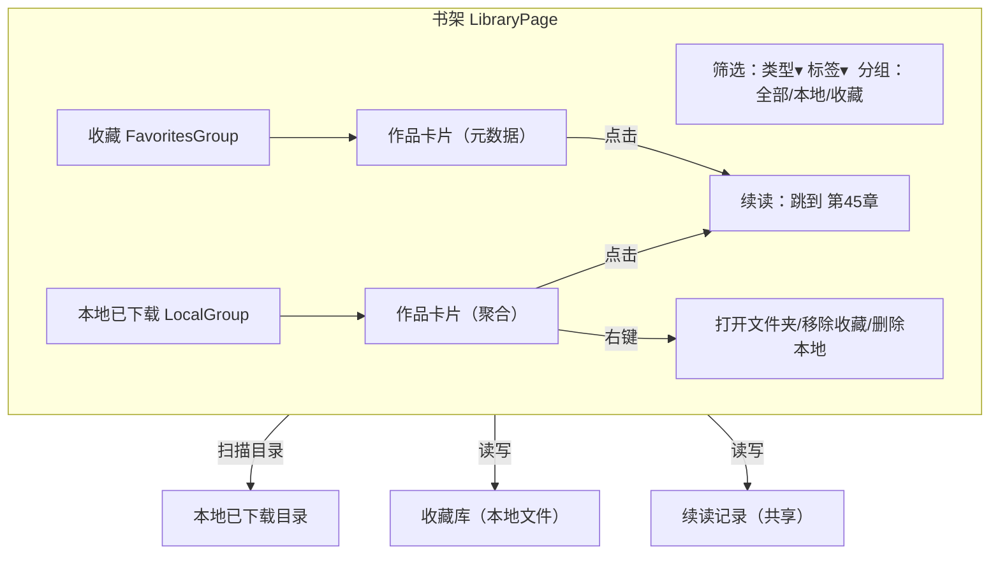

# 界面 6：书架 / 库

> 形态：选项卡
> 导航：书架
> 状态：**功能点已定稿**

## 定位

**本地已下载内容 + 手动收藏**的聚合视图。收藏只存元数据（书名/来源/链接/封面），不依赖文件是否还在。续读记忆统一由书架管理。

## 功能点

| # | 功能点 | 说明 |
|---|---|---|
| 1 | 书库列表 | 本地已下载内容目录 + 在线收藏的并集，**按作品聚合**（一部一卡片） |
| 2 | 收藏 | 手动收藏作品（存元数据：书名/来源/链接/封面），文件删了收藏仍在 |
| 3 | 类型筛选 | 全部 / 小说 / 漫画 / 视频 |
| 4 | 标签筛选 | 按源 `$metadata.tags`（免费/日更等） |
| 5 | **续读记忆** | 每部作品显示"读到第45章/第3话/第6集"角标，点击直接续读（数据统一在书架） |
| 6 | 分组视图 | 本地 / 收藏 两个分组 |
| 7 | 导出/导入 | 书架配置可导出/导入（`library` 块），WebDAV 预留 |
| 8 | 空状态 | 插画 + "书架还空着，去发现里找点好东西吧" |

## 界面结构图



## 关键流程逻辑

### 书架内容来源
```
启动/刷新时
  → 扫描 download.output_dir → 列出已下载作品（按命名模板聚合）
  → 读取收藏库（本地文件）→ 列出收藏作品（元数据）
  → 两组并集 → 按类型/标签筛选 → 按作品聚合渲染
```

### 续读
```
点书架某作品卡片
  → 读续读记录 → 定位到 章节/话/集
  → 打开阅读器 → 直接跳到该位置
  → 阅读器内翻章 → 更新续读记录
```

### 收藏管理
```
任意界面点「收藏」
  → 写入收藏库（书名/来源/链接/封面/类型/标签）
  → 书架刷新出现该作品
「移除收藏」→ 只删元数据，不删本地文件
```

### 导出/导入
```
导出：书架配置（收藏+续读）序列化 → 本地文件
导入：读入 → 合并到当前书架
WebDAV：预留（future）
```

## 数据来源

| 区块 | 数据来源 |
|---|---|
| 本地已下载 | 扫描 `download.output_dir` |
| 收藏 | 收藏库本地文件（`library` 相关） |
| 续读位置 | 续读记录（书架统一管理，阅读器读写） |
| 作品元数据 | 收藏时保存的快照（来源/链接/封面/标签） |

## 空状态与异常

- 空书架：插画 + "书架还空着，去发现里找点好东西吧"
- 本地文件被删/移走：卡片显示"本地缺失"徽标，收藏仍在，可点击重新下载
- 扫描目录不存在：空列表 + 提示，不报错

## 界面草图

```
┌──────────────────────────────────────────────────────────────┐
│ 筛选:[类型▾][标签▾]  分组: 全部/本地/收藏                     │
├──────────────────────────────────────────────────────────────┤
│ ▼ 本地已下载 (3)                                              │
│  ┌──────────┐ ┌──────────┐ ┌──────────┐                     │
│  │ 封面      │ │ 封面      │ │ 封面      │                     │
│  │ 凡人修仙传 │ │ 咒术回战 │ │ 鬼灭之刃 │                     │
│  │ 读到45章  │ │ 读到12话  │ │ 读到3集  │                     │
│  │ (小说)    │ │ (漫画)    │ │ (视频)    │                     │
│  └──────────┘ └──────────┘ └──────────┘                     │
│ ▼ 收藏 (1)                                                    │
│  ┌──────────┐                                                 │
│  │ 封面      │                                                 │
│  │ 某作品    │ 本地缺失徽标 [重新下载]                          │
│  └──────────┘                                                 │
└──────────────────────────────────────────────────────────────┘
```

## 已确认

- 书架 = 本地已下载目录 + 手动收藏（元数据）。
- 按作品聚合展示。
- 续读记忆书架统一管（阅读器读写同一份）。

## 待讨论
- （暂无，进入下一界面讨论）
