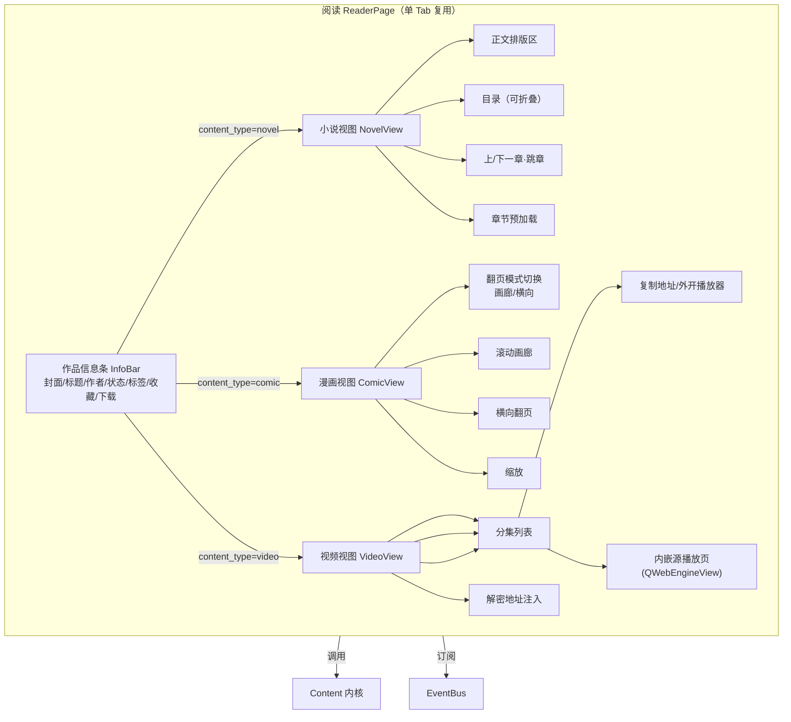

# 界面 4：内容阅读器

> 形态：选项卡
> 导航：阅读
> 状态：**功能点已定稿**

## 定位

打开某部作品观看：小说正文 / 漫画翻页 / 视频观看。**单 Tab 复用**——一次只看一部，打开新作品替换当前内容。

## 功能点

### 通用外壳（所有类型共有）

| # | 功能点 | 说明 |
|---|---|---|
| 1 | 作品信息条 | 封面、标题、作者、简介、状态、标签 |
| 2 | 操作按钮 | 收藏、加入下载、打开源详情页（浏览器） |
| 3 | 进入路径 | 发现/搜索直接点作品卡片进入 |

### 小说（正文阅读）

| # | 功能点 | 说明 |
|---|---|---|
| 4 | 正文排版区 | 衬线字体、行间距、**字号可调**（`ui.font_scale`） |
| 5 | 目录 | 左侧/底部可折叠目录，章节列表点击跳章 |
| 6 | 底部导航 | 上一章 / 下一章 / 跳到指定章 |
| 7 | 章节预加载 | 下一章后台预拉，翻章不卡 |
| 8 | 续读记忆 | 记录最后阅读章节，下次打开续读 |
| 9 | 长章节翻页 | 正文分多页时自动加载下一页（`body.paginator`） |
| 10 | **目录缓存** | 目录拉到本地缓存，断网/源挂也能看目录并续读 |
| 11 | **正文广告过滤** | 解析正文时按 adblock 规则剔除广告段落（见下「广告去除」） |
| 12 | **阅读背景/字体独立设置** | 阅读区背景色（护眼）、字体类型、字号可独立于全局主题设置 |
| 13 | **全屏阅读** | 工具条 ⛶ 进入全屏：主窗全屏 + 隐藏信息条/Tab 栏（沉浸），Esc 或再点 ⛶ 退出并还原窗口状态；切走阅读器 Tab 自动退全屏 |

### 漫画（翻页阅读）

| # | 功能点 | 说明 |
|---|---|---|
| 14 | 按页加载 + 预加载 | 图片逐页加载，预加载下一页 |
| 15 | **翻页模式可切换** | 滚动画廊（竖向连续，默认）/ 横向翻页（像翻书，左右按钮/滑页） |
| 16 | 图片缩放 | 点击放大 / 双击还原 |
| 17 | 分页加载 | `page.paginator`，防止一次拉几十张图卡死 |
| 18 | **漫画广告图过滤** | 图片列表里识别并剔除广告图（尺寸异常 / URL 含 ad/banner/promo / 数据流类型标记） |
| 19 | **全屏阅读** | 工具条 ⛶ 进入全屏：主窗全屏 + 隐藏信息条/Tab 栏（沉浸），Esc 或再点 ⛶ 退出并还原窗口状态；切走阅读器 Tab 自动退全屏 |

### 视频（观看方案）

| # | 功能点 | 说明 |
|---|---|---|
| 18 | 分集列表 | 全部剧集，点击选看 |
| 19 | **方案 A（主）：地址 + 外开** | 每集「复制地址」/「用外部播放器打开」（如 potplayer），真实地址已解密 |
| 20 | **方案 B（可选增强）：内嵌源播放页** | 「在应用内观看」按钮 → QWebEngineView 加载源播放页 URL，站点自带播放器 |
| 21 | 播放地址解密 | 从源配置 `decrypt_api` 解密后注入/展示 |
| 22 | **视频广告过滤** | 内嵌播放页加载时屏蔽广告元素（`.ad-container`/`#adbox` 等）；播放列表里剔除广告流 |

> 视频第一版不做 QMediaPlayer 直接播流（m3u8/DRM/解码跨平台坑多）。体验最优路径是：能直接看（内嵌源页）+ 能拿地址外开。

### 阅读交互 / 鼠标快捷键（小说 / 漫画 / epub 通用）

三视图统一提供以下阅读体验快捷操作，鼠标即可完成翻章/调样式，不必一直点按钮：

| # | 操作 | 说明 |
|---|---|---|
| 23 | **鼠标侧键翻章** | 前侧键 XButton2 → 下一章/下一话；后侧键 XButton1 → 上一章/上一话（浏览器前进/后退同向） |
| 24 | **向前缓存 3 章** | 以当前章为基点预取前 3 章，向上翻章命中缓存秒开（novel/comic；comic 同时保留向后预取窗口） |
| 25 | **背景色循环「背景」按钮** | 工具条按钮循环 白 / 米黄 / 护眼绿 / 夜间黑，三视图同步切换；选择写回设置记忆，下次打开沿用 |
| 26 | **Ctrl+滚轮缩放** | 小说/epub 正文实时调字号；漫画（在线 + 本地 epub）Ctrl+滚轮 = 图片缩放：图片跟随缩放重新渲染/重排，可放大到超过原图尺寸（放大方向允许像素化） |

> epub 本地阅读同样支持 23/24/25/26；epub 向前翻章读本地 zip 为毫秒级，无需 24 的网络缓存。
> 本地漫画 epub：图片**后台并发解码 + 等高占位回填**（主线程只预读尺寸建占位），首屏秒出、不整章同步解码卡界面；Ctrl+滚轮缩放同样走后台重解码。

## 界面结构图



## 关键流程逻辑

### 进入阅读器
```
发现/搜索点作品卡片
  → 传 {source_id, book_url, content_type}
  → 读取器：拉详情 → 渲染信息条 → 按 content_type 切对应视图
  → novel: 拉章节列表 → 定位续读章节 → 渲染正文 + 预加载下一章
  → comic: 拉章节 → 渲染第一话 → 预加载图片
  → video: 拉分集列表 → 默认选第一集 → 展示地址（解密后）
```

### 章节切换（小说）
```
点下一章
  → 若已预加载 → 直接显示
  → 否则 → 拉取 → 显示 → 记录续读位置 → 后台预加载再下一章
```

### 漫画翻页
```
滚动画廊：图片竖向排列，滚动浏览 → 滚动接近底部 → 拉下一页
横向翻页：左右按钮/滑页 → 预加载上一/下一页
```

### 视频观看
```
选某集 → fetch_video_episode(source, episode_url)
  → 内核提取 play_url → 若有 decrypt_api → 解密得真实地址
  → 视图展示：真实地址文本 + 「复制」 + 「外部播放器打开」 + 「在应用内观看」
```

### 退出/续读
```
关闭阅读器 / 切换 Tab → 保存续读位置（novel 记章节，comic 记话+页，video 记集）
```

## 数据来源

| 区块 | 数据来源 |
|---|---|
| 作品信息 | `endpoints.detail` → `fields.title/author/cover/summary/status` |
| 小说正文/章节 | `endpoints.content.chapter` → `body.selector` + `list` |
| 漫画图片 | `endpoints.content.page` → `list.fields.url` + `list.paginator` |
| 视频分集/地址 | `endpoints.content.episode` + `play_url` + `decrypt_api` |
| 续读位置 | 本地续读记录（与书架共享） |

## 空状态与异常

- 正文解析失败：`ContentMissingError` → 显示"未解析到正文，可能站点改版" + 去诊断
- 图片加载失败：占位图 + 重试按钮
- 视频地址解密失败：`DecryptError` → 显示错误 + 重试
- 内嵌播放页加载失败：提示 + 回退「复制地址外开」

## 界面草图

```
┌──────────────────────────────────────────────────────────────┐
│ [封面] 书名          作者  ·  连载中  ·  [收藏][下载][源详情] │
├──────────────────────────────────────────────────────────────┤
│  小说视图:                                                    │
│  ┌────────────┐  正文区域（字号可调）                        │
│  │ 目录 ──┐   │  春江潮水连海平，海上明月共潮生。            │
│  │ 第一章 │   │  ...                                          │
│  │ 第二章 │   │                                               │
│  │ ...    │   │  [←上一章] 第3/120章 [下一章→]               │
│  └────────┘   │                                               │
│  漫画视图:                                                    │
│  [画廊模式] [横向模式]  (切换)                               │
│  图片 1 / N（预加载下一页，缩放）                             │
│  视频视图:                                                    │
│  [分集: 1▾ 2 3 4...]  [▶在应用内看] [复制地址] [外部打开]   │
│  播放地址: http://cdn.xxx/.../ep4.m3u8 (已解密)               │
└──────────────────────────────────────────────────────────────┘
```

## 已确认

- 视频：主方案 A（复制地址/外部播放器）+ 可选 B（内嵌源播放页）；不做 QMediaPlayer 直播。
- 阅读器：单 Tab 复用。
- 漫画：滚动画廊 + 横向翻页可切换。
- 小说：字号/行间距/目录侧栏/章节预加载/续读记忆，全要。
- **广告去除**：全局规则库按类型（novel/comic/video）分 + 源级补充规则（详见 core.md adblock）。
- **阅读背景/字体独立设置**：阅读区可独立于全局主题。
- **小说目录缓存**：断网也能看目录。
- **全屏阅读**：小说/漫画/epub 三视图工具条 ⛶ 全屏（视频复用其独立全屏）；沉浸式隐藏信息条 + Tab 栏，Esc 退出。
- **阅读快捷操作**（小说/漫画/epub）：鼠标侧键翻章；向前缓存 3 章；背景色循环按钮（白/米黄/护眼绿/夜间黑，记忆选择）；小说/epub 正文 Ctrl+滚轮调字号；漫画（在线 + 本地 epub）Ctrl+滚轮 = 图片缩放（在线图随缩放重排、epub 图按缩放重新解码，均保留阅读比例）。

## 广告去除（阅读器应用）

阅读器三个类型分别应用 adblock 过滤：

| 类型 | 过滤位置 | 规则来源 |
|---|---|---|
| 小说 | 正文段落（剔除广告段） | `rules_novel.yaml` + 源补充 |
| 漫画 | 图片列表（剔除广告图） | `rules_comic.yaml` + 源补充 |
| 视频 | 播放页 DOM（屏蔽广告元素）+ 播放列表（剔除广告流） | `rules_video.yaml` + 源补充 |

> 详见 core.md 的 adblock 模块设计。

## 待讨论
- （暂无，进入下一界面讨论）
