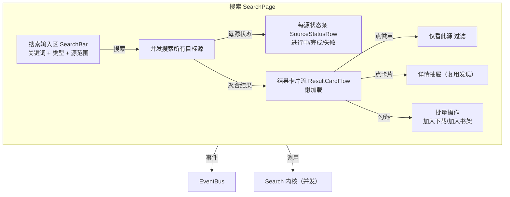

# 界面 3：搜索

> 形态：选项卡
> 导航：搜索
> 状态：**功能点已定稿**

## 定位

关键词驱动的跨源 / 单源搜索。与「发现」互补：发现是"逛站"，搜索是"精确找"。

## 功能点

| # | 功能点 | 说明 |
|---|---|---|
| 1 | 搜索输入区 | 关键词输入 + 类型筛选（全部/小说/漫画/视频）+ 源范围（全部源/指定源）+ 搜索按钮 |
| 2 | 结果卡片流 | 封面、标题、**来源角标**、作者、更新、权重排序（`$weight`） |
| 3 | **来源角标可筛选** | 点击卡片右上角来源徽章 → 结果列表过滤为仅该源（再点恢复全部） |
| 4 | 跨源并发进度 | 每个源一个小状态条（进行中/完成/失败），实时可见 |
| 5 | 懒加载分页 | 滚动到底自动加载下一页，上限 `constraints.search.max_pages/max_results` |
| 6 | 结果不去重 | 各源各显示一条，来源角标本身即区分；同一书多源版本并列展示 |
| 7 | **合并相似结果开关** | 默认关。开启后按书名+作者模糊匹配合并相似结果，展开可看各源版本 |
| 8 | 勾选批量 | 多选结果 → 加入下载队列 / 加入书架 |
| 9 | 搜索历史 | 最近 20 条（与首页共享），点击一键重搜 |
| 10 | 空状态/失败 | 无结果：插画+台词；单源失败：该源状态条标红，其余正常返回 |

## 界面结构图



## 关键流程逻辑

### 触发搜索
```
输入关键词 → 点搜索 / Ctrl+Enter
  → SearchHistory.push(keyword)   # 写入历史（最多20条）
  → 按类型/源范围选中目标源集合
  → 并发请求（concurrency = app_config.network.concurrent_search_sources）
  → 每源结果到达 → 追加到卡片流 + 更新该源状态条
  → 全部结束 → 状态条全部置完成/失败
```

### 来源角标筛选
```
点某卡片的来源徽章
  → 列表过滤为 source_id == 该源 的条目
  → 顶部显示"仅看 [源名]" 过滤chip + 关闭按钮
  → 点关闭 → 恢复全部
```

### 懒加载
```
滚动到底 → 请求下一页（该源/全部源的下一结果页）
  → 追加卡片
  → 达到 max_pages 或 max_results → "到底啦～"
```

### 批量操作
```
勾选 ≥1 条 → 底部批量操作栏出现
  → 「加入下载」→ DownloadQueue.add(book, chapters)
  → 「加入书架」→ Library.add_favorite(book)
```

## 数据来源

| 区块 | 数据来源 |
|---|---|
| 搜索结果 | `Search.search_type()` / `search_one()` 统一 `SearchResult` |
| 每源状态 | EventBus `SEARCH_PROGRESS` / `SOURCE_ERROR` |
| 来源过滤 | 结果内 `source_id` 字段 |
| 搜索历史 | `SearchHistory`（本地文件，与首页共享） |
| 排序权重 | 结果 `$weight`（跨源排序用） |

## 空状态与异常

- 无结果：插画 + "搜不到这个哦，换个词试试？"
- 部分源失败：该源状态条标红 + 可点开看错误（诊断入口），其余源正常
- 全部源失败：整页提示 + 「去诊断」
- 搜索超时/被限流：`RequestError` → 源状态条红 + 可重试

## 界面草图

```
┌──────────────────────────────────────────────────────────┐
│ [关键词输入框.........] [类型▾][源范围▾] [🔍搜索]       │
│ ──────────────────────────────────────────────────────── │
│ 源状态: 笔趣阁🟢 包子🟢 拷贝🟠失败(点开) B站🟢          │
│ ┌──────┬──────┬──────┬──────┐                             │
│ │封面  │封面  │封面  │封面  │   卡片流（懒加载）          │
│ │标题  │标题  │标题  │标题  │                             │
│ │[源]  │[源]  │[源]  │[源]  │   ← 徽章可点筛选            │
│ └──────┴──────┴──────┴──────┘                             │
│  ☑ (勾选) 批量: [加入下载] [加入书架]                      │
│  （滚动到底 → 自动加载下一页）                            │
└──────────────────────────────────────────────────────────┘
```

## 已确认
- 来源角标做 **B（点击可筛选）**。
- 搜索结果**不去重**，各源各显示，来源角标区分。
- **合并相似结果开关**（默认关，按书名+作者匹配，展开看各源版本）。
- 懒加载分页（与发现一致）。
- 搜索历史 20 条，与首页共享。

## 待讨论
- （暂无，进入下一界面讨论）
