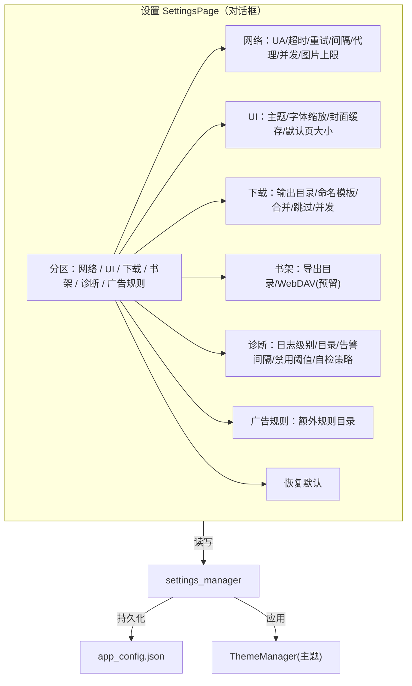

# 界面 9：设置

> 形态：对话框
> 导航：首页右上角 / 顶部栏
> 状态：**功能点已定稿**

## 定位

全量覆盖 `app_config.json` 五块配置。用户可调参数一个界面搞定。改动**多数实时生效**，少数需重启的字段标注"重启后生效"。

## 功能点

| # | 区块 | 包含字段 | 生效方式 |
|---|---|---|---|
| 1 | 网络 | UA、超时、重试、请求间隔、代理、并发搜索数、图片大小上限 | 实时（代理需重启） |
| 2 | UI | 主题（sakura/mint/midnight）、字体缩放、封面缓存、默认页大小 | 实时 |
| 3 | 下载 | 输出目录、命名模板、合并文本、跳过已存在、并发下载数 | 实时 |
| 4 | 书架 | 导出目录、WebDAV 地址/密码（预留） | 实时 |
| 5 | 诊断 | 日志级别、日志目录、坏源告警间隔、自动禁用阈值、自检策略（off/soft/strict） | 实时（日志目录重启） |
| 6 | **广告规则** | adblock 额外规则目录（可指定自定义规则目录，追加/覆盖内置） | 实时 |
| 7 | 重置 | 「恢复默认设置」按钮 | 确认弹窗后重置 |

## 界面结构图



## 关键流程逻辑

### 修改某字段
```
用户改字段 → 实时写 settings_manager（内存）
  → 多数实时生效（主题切换 / 字体缩放 / 并发数）
  → 需重启字段（代理/日志目录）→ 打"重启后生效"角标
  → 点「应用」/关闭时 → 持久化到 app_config.json
```

### 主题切换
```
选主题 → ThemeManager.apply(theme) → 全局 QSS 刷新
  → 所有页面 on_theme_changed() → 不重启不刷新窗口
```

### 恢复默认
```
点「恢复默认」→ 确认弹窗 → 重置 app_config.json 为默认 → 刷新全部
```

## 数据来源

| 区块 | 数据来源 |
|---|---|
| 全部字段 | `app_config.json`（settings_manager 读写） |
| 主题 | `app_config.ui.theme` → ThemeManager |
| 广告规则目录 | `app_config.adblock_extra_dir` → adblock 引擎 |

## 空状态与异常

- 配置损坏：settings_manager 读失败 → 用默认值 + 告警，不崩溃
- 输出目录不存在：下载时自动创建，设置里可校验
- WebDAV 密码：预留字段，第一版不实现（仅存值）

## 界面草图

```
┌──────────────────────────────────────────────────────────────┐
│ 设置                          [网络][UI][下载][书架][诊断][广告] │
├──────────────────────────────────────────────────────────────┤
│ 网络                                                          │
│  User-Agent  [Mozilla/5.0 (... )_______]                    │
│  超时(秒)    [10]     重试次数  [3]                          │
│  请求间隔(ms)[500]    代理      [http://...______]  (重启生效)│
│  并发搜索数  [4]      图片上限  [5MB]                        │
│ UI                                                            │
│  主题  (●) sakura  ( ) mint  ( ) midnight    ⟳预览           │
│  字体缩放  [1.0─────────────]                                 │
│  封面缓存  [256MB]      默认页大小  [20]                      │
│ 广告规则                                                      │
│  额外规则目录 [C:/.../my_adrules______]  (追加/覆盖内置)      │
├──────────────────────────────────────────────────────────────┤
│                        [恢复默认]    [取消]    [应用]         │
└──────────────────────────────────────────────────────────────┘
```

## 已确认

- 全量覆盖 app_config.json 五块 + adblock 规则目录。
- 多数实时生效，需重启字段标注"重启后生效"。
- 「恢复默认」带确认弹窗。

## 待讨论
- （全部界面已定稿，进入内核实现规划）
