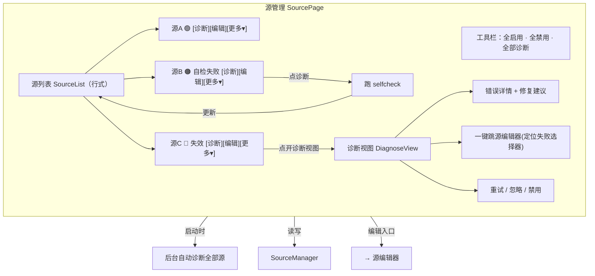

# 界面 7：源管理（含诊断）

> 形态：选项卡
> 导航：源管理
> 状态：**功能点已定稿**

## 定位

管理所有数据源：启停、健康状态、权重、编辑入口，并内嵌故障诊断。日常"源坏了怎么办"也在这里处理。

## 功能点

| # | 功能点 | 说明 |
|---|---|---|
| 1 | 源列表 | **列表行式**：每源一行，名称、类型徽章、`$enabled` 开关、健康状态灯、权重 |
| 2 | 健康状态灯 | 绿=正常 / 黄=自检软失败 / 红=失效（自检硬失败或连续失败 `max_failures` 次） |
| 3 | **诊断按钮** | 点击 → 对当前源跑一次 selfcheck → 更新健康灯 + 显示结果 |
| 4 | 启动自动诊断 | **应用启动时后台自动对所有源诊断一次**（静默，不阻塞启动），健康灯一开始就准确 |
| 5 | 权重排序 | 可拖动调整 `$weight`（影响搜索排序） |
| 6 | 单源操作 | 搜索该源（跳搜索）、打开官网（`$metadata.homepage`）、编辑（跳源编辑器）、删除、复制模板 |
| 7 | 诊断视图 | 失效源错误详情（`StructureChangedError` 取样）、修复建议、一键跳源编辑器并定位失败选择器 |
| 8 | 坏源处理 | 手动重试 / 忽略 / 禁用 |
| 9 | **删除二次确认** | 删除弹窗确认：默认软删除（`$enabled=false`，配置保留可恢复）；可选「同时删除配置文件」（真删） |
| 10 | 批量操作 | 全启用 / 全禁用 / 全部诊断 |
| 11 | **健康状态历史** | 每个源记录最近 N 次诊断结果，显示绿/黄/红历史点（判断"一直不稳定还是偶发"） |
| 12 | 空状态 | 无源：插画 + "还没有源哦，要不要找一只？" + 「添加源」按钮 |

## 界面结构图



## 关键流程逻辑

### 启动自动诊断
```
App 启动 → SourceManager 加载源 → 后台线程
  → 对每个启用源跑 selfcheck
  → 更新健康灯（绿/黄/红）→ 失败源进诊断视图
  → 不阻塞主界面（异步）
```

### 手动诊断按钮
```
点某源「诊断」
  → 对该源立即跑 selfcheck
  → 更新健康灯
  → 失败 → 展开该源诊断视图：错误详情 + 修复建议
```

### 删除（二次确认）
```
点某源「删除」
  → 弹窗1：确认删除？"删除后该源不再出现，配置可恢复"
        [软删除(默认)] [取消]
  → 勾选"同时删除配置文件" → 弹窗2："配置文件将被永久删除，确认？"
        [确认删除] [取消]
  → 软删除 → $enabled=false，配置保留
  → 真删 → 删除 sources/*.json 文件
```

### 诊断视图定位失败选择器
```
诊断视图显示 StructureChangedError
  → 点「修复」→ 打开源编辑器
  → 自动定位到失败字段（如 check_selector / 某 selector）→ 高亮
```

## 数据来源

| 区块 | 数据来源 |
|---|---|
| 源列表 | `SourceManager.all()` |
| 健康状态 | `selfcheck` 结果 + 失败计数 |
| 诊断详情 | `StructureChangedError` / 最近错误取样 |
| 权重 | `$weight` 字段（可拖拽更新） |
| 官网 | `$metadata.homepage` |
| 删除/禁用 | `$enabled` + 配置文件删除 |

## 空状态与异常

- 无源：插画 + "还没有源哦，要不要找一只？" + 「添加源」
- 全部失效：列表全红 + 顶部提示"所有源都失效了" + 「全部诊断」
- 诊断接口超时：该源标黄"检测超时"，可重试
- 删除配置被占用（文件锁）：提示稍后再试

## 界面草图

```
┌──────────────────────────────────────────────────────────────┐
│ [全启用] [全禁用] [全部诊断]          [＋添加源]              │
├──────────────────────────────────────────────────────────────┤
│ 源名        类型  状态    权重   操作                          │
│ ──────────────────────────────────────────────────────────── │
│ 七猫小说    小说  🟢启用  [1.5↕] [诊断][编辑][更多▾]          │
│ 包子漫画    漫画  🟠启用  [1.0↕] [诊断][编辑][更多▾]          │
│                └─ 自检失败: 校验标签 .site-header 未命中      │
│                  [一键修复→编辑器] [重试] [忽略] [禁用]        │
│ 拷贝漫画    漫画  🔴禁用  [0.8↕] [诊断][编辑][更多▾]          │
│                └─ 连续3次失败已自动禁用                        │
│ B站         视频  🟢启用  [1.0↕] [诊断][编辑][更多▾]          │
└──────────────────────────────────────────────────────────────┘
```

## 已确认

- 列表行式布局。
- 启动时后台自动诊断全部源一次。
- 删除二次确认：默认软删除（`$enabled=false`），可选「同时删除配置文件」真删。
- **健康状态历史**：记录最近 N 次诊断，绿/黄/红历史点。

## 待讨论
- （暂无，进入下一界面讨论）
